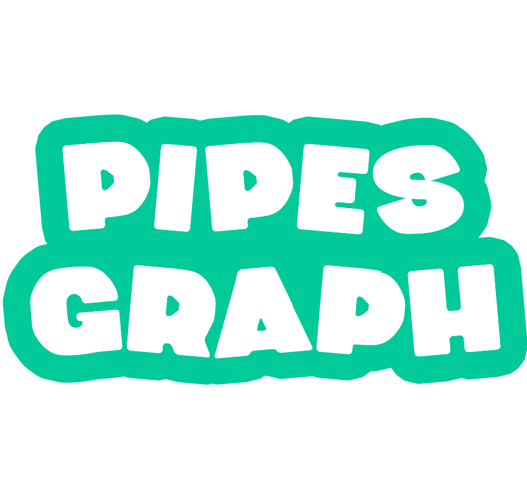

# PIPES GRAPH

  

  <a href="#star-introdução">Introdução</a>&nbsp;&nbsp;|&nbsp;&nbsp;
  <a href="#keyboard-tecnologias">Tecnologias</a>&nbsp;&nbsp;|&nbsp;&nbsp;
  <a href="#computer_mouse-instalação">Instalação</a>&nbsp;&nbsp;|&nbsp;&nbsp;
  <a href="#round_pushpin-rotas">Rotas</a>

# :star: Introdução

Esse app foi construído durante a realização do curso CIC270 - Computação Gráfica na Universidade Federal de Itajubá e consiste no projeto final da disciplina.
Em sua essência, se trata de um jogo construído com base no conceito de Teoria de Grafos por meio da biblioteca gráfica WebGL.

Inicialmente, é preciso fornecer um contexto sobre qual o background para a história em que se passa o game: os personagens Luigi e Bowser, do universo de Super Mario, entraram em conflito sendo que Bowser conseguiu sequestrar a fugir com Luigi, trancafiando-o em uma prisão subterrânea. Dessa forma, Mário (o próprio player) precisa partir em uma missão para resgatar Luigi, na qual ele será exposto a um desafio para calcular o maior caminho de um grafo representado por um sistema de encanamento.

Nesse contexto, foi utilizado o algoritmo de Dijkstra para realização da verificação da resposta do usuário.

Por fim, caso Mario saia vitorioso, Luigi é solto são maiores problemas. Caso contrário, Luigi se afoga com a água que está a inundar a prisão em que se encontra.

# :keyboard: Tecnologias

A realização de gerenciamento de janela foi feito por meio do framework NextJs sobre o React, fornecendo uma solução robusta para tal função.
Ademais, como o app engloba tanto cenários 3D, como 2D, é interessante separar as tecnologias usadas entre esses dois conceitos de visualização de dimensões:

- 3D:

| Nome               | Função                                                                                                                                                                   |
| ------------------ | ------------------------------------------------------------------------------------------------------------------------------------------------------------------------ |
| three              | Biblioteca JavaScript OpenSource que, através da WebGL, realiza a exibição e gerenciamento de elementos 3D diretamente no navegador                                      |
| react-three/drei   | Conjunto de funções auxiliares para tratar objetos 3D. Em suma, foi utilizado para realizar o carregamento dos modelos tridimensionais                                   |
| react-three/fiber  | Ferramenta que permite a renderização de objetos 3D primitivos e importados. Além disso, consta com uma série de métodos para manipulação de propriedades desses objetos |
| react-three/rapier | Biblioteca responsável por inserir e tratar eventos relacionados a física dos objetos, como: colisões e gravidade                                                        |

- 2D:

| Nome   | Função                                                                                                                                                                                                    |
| ------ | --------------------------------------------------------------------------------------------------------------------------------------------------------------------------------------------------------- |
| Phaser | Biblioteca OpenSource criada sobre a WebGL voltada para a construção de jogos 2D. Ela abriga uma série de métodos capazes de manipular eventos, renderização, controle de entrada e saída, dentre outros. |

# :computer_mouse: Instalação

O primeiro passo é ter o NodeJs e o npm instalados em sua máquina. Para isso siga os seguintes passos:

1. Instale o CURL caso ainda não o tenha:

   `sudo apt install curl`

2. Instale o NVM para instalação e gerenciamento das versões do Node:

   `curl https://raw.githubusercontent.com/creationix/nvm/master/install.sh | bash`

3. Atualize as variáveis de ambiente:

   `source ~/.bashrc`

4. Faça a instalação do NodeJs. Para esse projeto é importante utilizar uma versão atualizada, preferencialmente a lts:

   `nvm install --lts`

5. Cheque se a instalação ocorreu bem (você deverá receber o número da versão do Node ao executar o comando):

   `node -v`

6. Instale o gerenciamento de pacotes npm:

   `sudo apt install npm`

7. Cheque se a instalação ocorreu bem (você deverá receber o número da versão do npm ao executar o comando):

   `npm -v`

Com o Node instalado é preciso fazer o clone do projeto em sua máquina, para isso você precisará do git. Siga os seguintes passos:

1. Seguindo o padrão para distribuições Linux Ubuntu, instale o git caso ainda não o tenha:

   `sudo apt-get install git-all`

2. Redirecione o caminho do terminal para o local em que você deseja clonar o projeto e execute o comando:

   `git clone https://github.com/paulojr-eco/WebGL-Game`

3. Vá para a pasta do projeto:

   `cd WebGL-Game`

Por fim, estando no diretório do projeto, vamos instalar as dependências necessárias e finalmente executar o app:

1. Instale as dependências do projeto:

   `npm install`

2. Por fim, ao término do último passo, rode a aplicação através do comando:

   `npm run dev`

3. Aguarde a mensagem "- Local: http://localhost:3000" ser exibida em sua terminal

4. Acesse a rota 3000 por meio do link http://localhost:3000 para visualizar o projeto

# :round_pushpin: Rotas

- `/` => Página inicial para visualização da história background e contexto do game
- `/game` => Página com a interface de instrução ao jogador, contendo indicações para começar o jogo, instruções e redirecionamento para a página "Sobre"
- `/game/instructions` => Página de instruções sobre como jogar
- `/game/about` => Página com mais informações sobre o autor e tecnologias utilizadas para a construção do app
- `/play` => Página do jogo em si, em que o usuário pode interagir com os objetos para concluir o desafio
